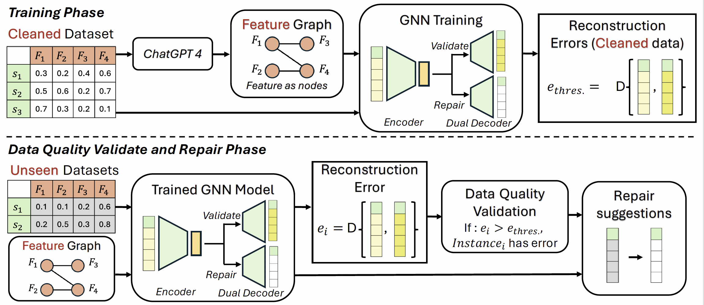

# DQuaG

# Automated Data Quality Validation Using Graph Representation Learning

## Overview

This repository contains the implementation of DQuaG (Data Quality Graph), a novel approach for automated data quality validation using graph representation learning. Our method leverages Graph Neural Network (GNN) to detect and infer underlying data quality issues in datasets. This approach is designed to overcome limitations of traditional data quality validation methods which often fail to capture complex interdependencies within the data.

*Figure 2: Framework of DQuaG approach*

## Installation

To run the code, please follow these steps to set up your environment:

1. Clone the repository
2. Install the required packages:
pip install -r requirements.txt

## Experimental Setup

Our experiments were conducted using the following environment:

- Python 3.11
- PyTorch 1.12.1

### Datasets

We evaluate our approach using datasets with varied error types and data structures:

- **Datasets with Ground-Truth Errors**:
- *Airbnb Data*: Contains listings for New York City. https://www.kaggle.com/datasets/sandeepmajumdar/airbnbnyccleaned
- *Chicago Divvy Bicycle Sharing Data*: Includes trip data from the Divvy bike-sharing program in Chicago. https://www.kaggle.com/datasets/yingwurenjian/chicago-divvy-bicycle-sharing-data/data

- **Datasets Without Ground-Truth Errors**:
- *New York Taxi Trip Data*: Comprises taxi trip records in New York City. https://data.cityofnewyork.us/Transportation/2015-Yellow-Taxi-Trip-Data/2yzn-sicd/about\_data
- *Hotel Booking Data*: Booking information for city and resort hotels. https://www.kaggle.com/datasets/jessemostipak/hotel-booking-demand/data
- *Credit Card Data*: Contains information on credit card applications. https://www.kaggle.com/datasets/rikdifos/credit-card-approval-prediction?select=application\_record.csv

## Code Structure

This repository contains the following Jupyter notebooks at the root directory, each serving a specific purpose within the DQuaG framework:
- `requirements.txt`: All necessary Python dependencies.
  
These notebooks are designed to be run sequentially to understand the implementation and to replicate our experimental results.

